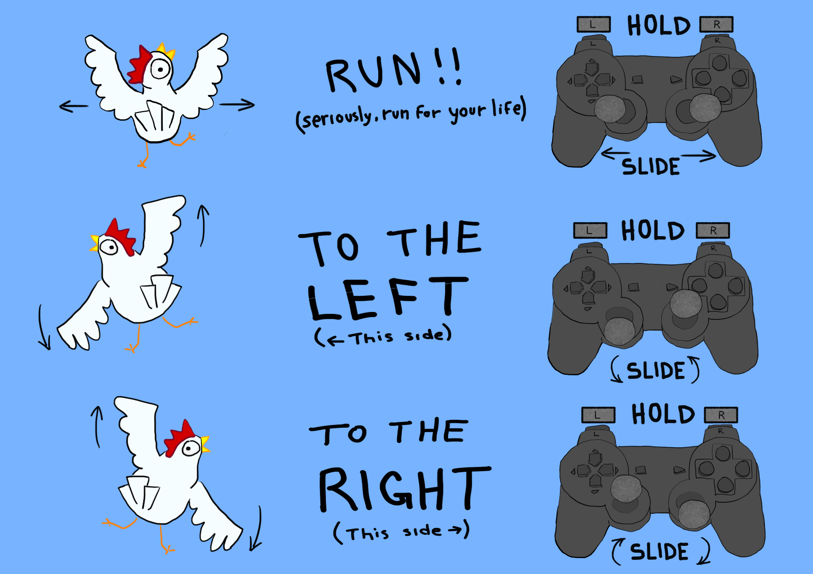

This repository contains a game made for the Game Off Game Jam 2018.

Chicken Downhill is a racing game which uses hybrid controls. Both an X-Box-Like controller and a keyboard are necessary to play it.

This game was developed by Tatopeba Games: a small, independent game studio. Please visit our homepage and support us: http://www.tatopeba.com.br

# Story

In a farm at the top of the hill, a chicken escapes its coop to avoid becoming the farmer's next meal. However, the farmer won't let his livestock go away that easily.

You have to guide the runaway chicken to the bottom of the hill, where other chickens have found everlasting peace, according to chicken rumors.

Be careful with obstacles on your way downhill, and peck some worms to gain **boosting power**.

# Controls

To avoid stumbling, you must:

* Hold controller **L** button pressed
* Hold controller **R** button pressed
* Hold the controller left stick in the left half-circle region
* Hold the controller right stick in the right half-circle region

Images should speak thousand words (we do hope so):

To move your chicken around, you have to:

* Moving **left**: Move the **left stick down** and the right stick up
* Moving **right**: Move the **right stick down** and the left stick up

Remember to keep the controller sticks in the allowed regions. Otherwise, the chicken will stumble (and eventually get fried).

# Pecking time!

There are some moments in the game that will require pressing keys on the keyboard.

Then you ask: "but how will I accomplish such task when all my fingers are busy with this \*\*\*\*\* controller"?

Well, you can always use your nose and **peck** your keyboard.

If your peck succeeds, the chicken shall receive a nice boosting power, which gives it a nice advantage while running away from the fate of the farmer's frying pan.

# Credits

The following open source assets were used in this project:

* Intro music theme: https://www.youtube.com/watch?v=Ih9LHLdJTI4
* Downhill music theme: https://www.youtube.com/watch?v=tY9tzsIG9kM
* TrueType font: https://github.com/adobe-fonts/source-code-pro
* Stumble SFX: https://freesound.org/people/bone666138/sounds/198876/
* Pecking Time Alert SFX: https://freesound.org/people/steveygos93/sounds/103588/
* Boost SFX: https://freesound.org/people/Eponn/sounds/420998/
* Soccer whistle SFX: https://freesound.org/people/Pablo-F/sounds/90743/
* Good ending music theme: https://www.youtube.com/audiolibrary/music?feature=blog (The 126ers - Palmetto Moon)
* Bad ending music theme: https://www.youtube.com/audiolibrary/music?feature=blog (Josh Lippi & The Overtimers - St. Francis)